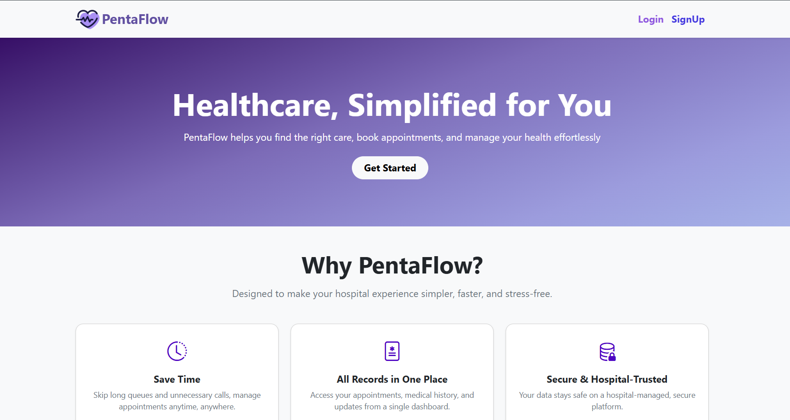

# hospital_management_v2

**Hospital Management System (HMS)** web application will allow efficient management of patients, doctors, appointments, and treatments in one unified place.

## Preview


## Installation and Setup
### ※ Environment Setup
### To start the application locally you need to have already installed the following in your system(Linux):
    
1. Python(3.10+) and pip -> Linux systems already comes with pre-installed python, check (python3 --version) 
2. Node(24.14.0 LTS) -> https://nodejs.org/en/download
3. Redis -> https://redis.io/docs/latest/operate/oss_and_stack/install/install-stack/apt/
4. Docker -> https://docs.docker.com/desktop/setup/install/linux/ubuntu/

### ※ Package Installation
> Make sure you are in the project root folder before procceding with the below steps
1. **Install Packages for Flask Backend server (Linux)**

```bash
python3 -m venv .venv && source .venv/bin/activate && 
pip install -r requirements.txt
```

2. **Install Packages for Vue Frontend server (Linux)**
```bash
cd app_frontend_VUE && npm install
```

### ※ Run the Application
> Make sure you are in the project root folder before procceding with the below steps
1. **To run the application backend server (Linux)**
```bash
source .venv/bin/activate && python3 app.py
```

2. **To run the application frontend server (Linux)**
```bash
cd app_frontend_VUE && npm run dev 
```

3. **Start Redis server (Linux)**
```bash
sudo systemctl start redis-server
```

4. **Check redis server is active or not (Linux)**
```bash
redis-cli ping 

## If the output is 'PONG' then active
```

### ※ Test SMTP Server Setup (Mailhog)
1. **Start Docker Service and Socket**
```bash
sudo systemctl start docker.service && 
sudo systemctl start docker.socket
```

2. **Check Docker service is active or not and the current running containers**
```bash
sudo docker ps
```

3. **Run the test smtp server with ui (mailhog)**
```bash
sudo docker run -d -p 1025:1025 -p 8025:8025 mailhog/mailhog
```

##  Note: 
1. When the application runs for the first time it will create the frontend distribution on its own using python subprocess library to run 'npm' build command. The compiled frontend dist will be then served from the same backend server index route.

2. I am using 'mailhog' a testing smtp server and for that we need docker services, else docker has not been used anywhere in the project.

3. Celery worker and beat processes are being auto triggered by the python suprocess, so no need to start the processes separately.

## Ports:

* http://localhost:5080/ - flask backend
* http://localhost:5173/ - vue frontend
* http://localhost:6379/ - redis server
* http://localhost:1025/ - mailhog smtp server
* http://localhost:8025/ - mailhog email dashboard UI